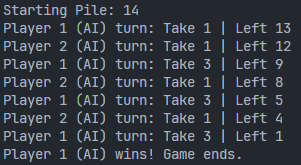
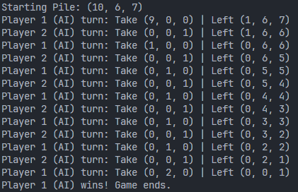

# Master Minimax Algorithm with Game of Nim 

## How to run

Just specify game you want to play and run

``` bash
python console.py -g simple
# python console.py -g regular --first Human
# python console.py -g misere --second Human
# python console.py -g split --first Human --second Human
```

## Some example games

- Simple Nim

    

- Regular Nim

    


## New knowledges learned from this projects

- How to use recursive to implement minimax algorithm
- Principle about minimax algorithm
- ~~Using `@cache` to cache minimax state~~ (Support in python > 3.9)
    > Instead using `@lru_cache(maxsize=None)`
- How to use Alpha-Beta Pruning

## TODO

- [ ] Implement more variants

## Reference

- [Minimax in Python: Learn How to Lose the Game of Nim](https://realpython.com/python-minimax-nim/)
